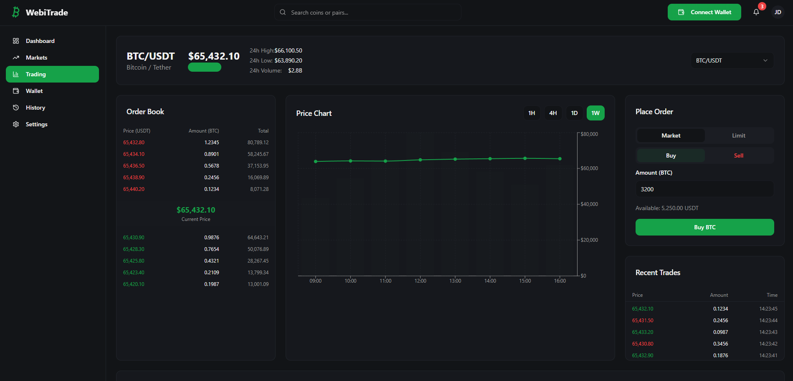

# Decentralized Trading Platform - WebiTrade

WebiTrade is a modern decentralized trading platform built with a full-stack approach, combining a React/TypeScript frontend, Solidity smart contracts, and a Node.js/Express backend. The platform offers a seamless trading experience, advanced analytics, wallet management, and robust security features.

---

## 📸 Screenshots




---

## 🚀 Features

- Real-time trading dashboard
- User authentication & KYC
- Wallet management (deposit, withdraw, transfer)
- Market analytics & charts
- Referral & rewards system
- Admin panel for governance
- Solidity smart contracts for trading, staking, governance, and tokens
- RESTful API backend (Node.js/Express)
- Responsive UI with shadcn-ui & Tailwind CSS

---

## 🗂️ Folder Structure

```
contracts/      # Solidity smart contracts
public/         # Static assets (images, icons, etc.)
server/         # Node.js/Express backend (API, controllers, models)
src/            # React frontend (pages, components, hooks, utils)
```

---

## 🛠️ Getting Started

### Prerequisites
- Node.js (v18+ recommended)
- npm or yarn
- Truffle (for smart contract development)

### Installation

```sh
# 1. Clone the repository
git clone https://github.com/monorepo06/webitrade.git
cd webitrade

# 2. Install dependencies (root)
npm install

# 3. Run the project
npm run dev

## 💡 Technologies Used

- **Frontend:** Vite, React, TypeScript, shadcn-ui, Tailwind CSS
- **Backend:** Node.js, Express, MongoDB (or your DB), JWT Auth
- **Smart Contracts:** Solidity, Truffle
